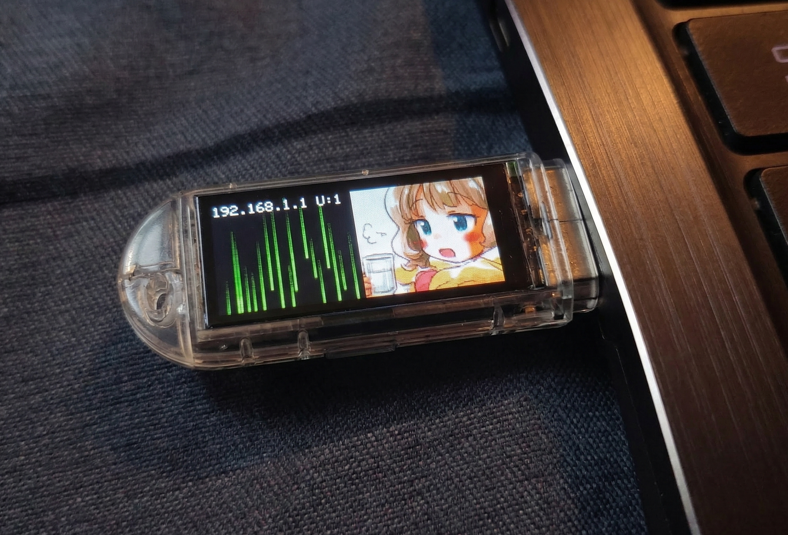
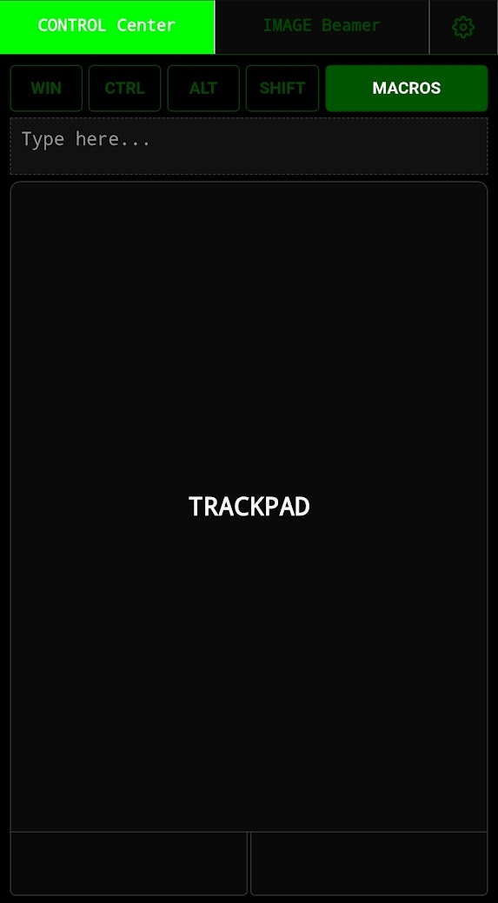
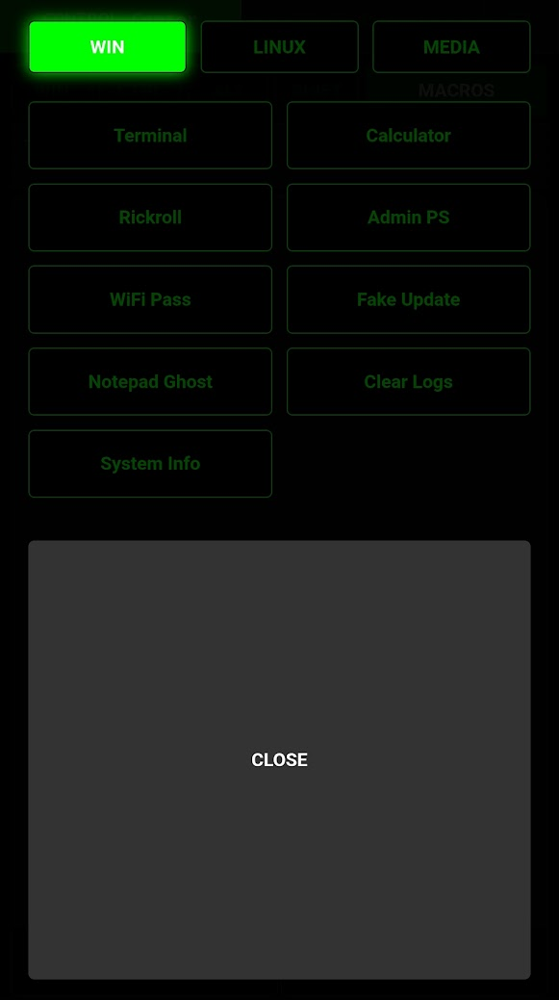

# PwnStick-S3

Built specifically for the **LILYGO® T-Dongle-S3** (ESP32-S3). It lets you control the keyboard and mouse via an Access Point created by the dongle. It can also act as a bluetooth keyboard and mouse.

**Hardware:** [Buy LILYGO® T-Dongle-S3 (With LCD) on AliExpress](https://ja.aliexpress.com/item/1005004860003638.html)

<p align="center">
  
</p>
<!-- <p align="center">
  
  
</p> -->


## Features

### 1. Dual-Mode Wireless HID Control (USB & BLE)
*   **Keyboard Injection:** Low-latency keystroke streaming via WebSockets. Supports international character sets, paste-streaming, and custom macros for Windows, Linux, and Media controls.
*   **Dual Transport Layers:** Switch between injecting payloads over the physical USB connection or wirelessly over Bluetooth (BLE) with the click of a button in the Web UI.

### 2. Precision Trackpad & Gestures
*   **Two-Finger Scroll:** The mobile-friendly web trackpad natively supports two-finger scrolling—drag two fingers to scroll up and down.
*   **Multi-touch Clicks:** Supports one-finger tap for left-click and two-finger tap for right-click.

### 3. Media Beaming Engine
*   **Image & GIF Uploader:** Upload, crop, and beam static images or animated GIFs directly from your browser to the dongle's LCD screen. Full support for zooming, rotating, and panning before uploading.

---

## Installation

This project is built using **PlatformIO**. You can upload the firmware using either the VS Code GUI or the Command Line Interface (CLI).

### ⚠️ Important: Bootloader Mode
Before uploading the firmware, you must put the T-Dongle-S3 into **Bootloader Mode**. 
1. Press and **hold** the button on the back of the dongle.
2. While holding the button, plug the dongle into your computer's USB port.
3. Once inserted, you can release the button. The device is now ready to be flashed.

### Option A: VS Code (GUI)
1.  Clone this repository.
2.  Open the project folder in VS Code with the [PlatformIO extension](https://marketplace.visualstudio.com/items?itemName=platformio.platformio-ide) installed.
3.  Put the dongle into Bootloader Mode and connect it.
4.  Click the **Upload** icon (arrow) in the bottom PlatformIO toolbar.

### Option B: Command Line (CLI)
1.  Ensure you have **Python** installed, then install the **PlatformIO Core**:
    ```bash
    pip install platformio
    ```
2.  Put the dongle into Bootloader Mode and connect it.
3.  Navigate to the project directory in your terminal.
4.  Run the compile and upload command:
    ```bash
    pio run -t upload
    ```
    *If you have multiple devices connected, you may need to specify the port: `pio run -t upload --upload-port /dev/ttyACM0`.*

**After Upload:** The device will reboot and host a WiFi AP named **`PwnStick`**. Connect to it and access the interface at `http://192.168.4.1/`.

---

## Where is what

*   **Logic & UI:** The core application, including the embedded HTML/JavaScript dashboard and the WebSocket logic, is located in `src/main.cpp`.
*   **HID Drivers:** The transport layer is abstracted in `src/HidDriver.h`, with specific implementations for USB (`src/UsbHidDriver.cpp`) and Bluetooth (`src/BleHidDriver.cpp`).
*   **Hardware Drivers:** Low-level display handling is managed by `src/esp_lcd_st7735.c` and `src/esp_lcd_st7735.h`.
